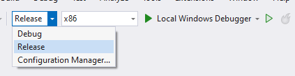
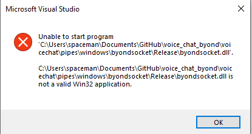

# voice chat byond

## general architecture

* [getUserMedia()](https://developer.mozilla.org/en-US/docs/Web/API/MediaDevices/getUserMedia) requires secure context to run (not http), so for now, Im using bogus certificates to serve over **https**. However it might be possible to serve the site over **byond** with something like `browse_cache("voicechat.html")` and use `link("file:///byond_web_cache_dir/voicechat.html")` instead
* right now distance is calculated at **O(N^2)**, however using a spatial indexing library like [rbush](https://github.com/mourner/rbush), it might be possible to get it down to **O(N * log(N) + idk)**
* roughly **10% of rtc connections fail** with this setup. This might be preventable by running a local [TURN](https://webrtc.org/getting-started/turn-server) server.


## building

### linux

I dont understand most ss13 build systems so you will have to run a few commands manually.

* or all at once: **run from project root**

    ```bash
    sudo apt install g++-multilib npm -y && cd voicechat/pipes && make && cd ../node && npm install && cd ../..
    ```

1. ensure you have **g++-multilib** and **npm** installed
    * `sudo apt install g++-multilib npm`
2. build **byondsocket.so** library
    * to talk to node from byond I use [unix sockets](https://en.wikipedia.org/wiki/Unix_domain_socket) and so we make a simple library to send stuff through an existing socket from byond.
    * `cd voicechat/pipes && make`
    * the only thing stopping me from making this crossplatform, is that I couldnt figure out how to make socket DLL for windows.
3. install **node dependencies**
    * while this **could be done through TGS** I dont understand it, so I use something more idiot proof like **node** to handle signaling and hosting static webpage
    * `cd ../node && npm install`
4. verify it worked
    * to **test node**, run `node voicechat/node/server/main.js`
    * if it worked it should run but with message about missing arguements

        ```txt
        HTTPS server running on port undefined
        socket server listening on byond_node.sock
        Failed to send command: The "options" or "port" or "path" argument must be specified
        ```

    * to **verify the library** you can do `ldd byondsocket.so`
    and it should return something along the lines of (with **different numbers**):

        ```txt
        linux-gate.so.1 (0x111111)
        libgcc_s.so.1 => /lib/i386-linux-gnu/libgcc_s.so.1 (0123546)
        libc.so.6 => /lib/i386-linux-gnu/libc.so.6 (0x1234567)
        /lib/ld-linux.so.2 (0x42069)
        ```

### windows

good luck man.

#### dependancies

* install node ([node download](https://nodejs.org/en/download))
* install visual studio ([visual studio installer](https://visualstudio.microsoft.com/downloads/))

#### building node components

1. open powershell as **administratior** and run `set-executionpolicy remotesigned`. This **lets you run commands from visual studio code**
2. open new terminal in visual studio code **(ctrl shift `)**
3. in the terminal type `npm install .\voicechat\node\` and press enter. node should be ready.

#### building library components

1. in this folder navigate to voicechat/windows/byondsocket/
2. click on byondsocket.sln to open it in visual studio.
3. visual studio code should prompt you to install stuff click yes, after open the project.
4. set the two boxes at the top to **Release** and **x86**

    

5. to build press the second triangle, (the one with the green outline and light green fill)
6. if it was successful it should say unable to start program:

    

#### verify it worked.

1. in visual studio code after completing these steps, launch the game **shortcut F5**
2. in the verb bar (where you usual type say and ooc) type **tests** and press enter
3. something like this should output to world.log

    ```plaintext
    calling lib...
    calling lib worked
    send bad JSON...
    {"error":"invalid JSON","data":{}}
    send json with no command...
    {"error":"Missing or invalid command","data":{"message":"no command","extra":"still no command"}}
    send unknown command...
    pinging node
    {"error":"Unknown command","cmd":"nonexistant command","data":{"cmd":"nonexistant command"}}
    started: 430567 round trip: 430567 approx: 0 x 1/10 seconds, data: Hello from Node
    ```
